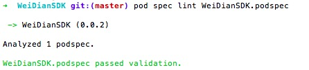

error
from django.core.management.validation import get_validation_errors
ImportError: No module named validation
mod = util.import_module("gunicorn.app.django_wsgi")
版本不对 请使用django1.6

查看django版本
import django
django.VERSION

升级／降级包
pip install --upgrade django==1.6.6

django-admin.py startproject mysite。这样会在你的当前目录下创建一个目录

python manage.py runserver 8080

STATIC_URL = '/static/'

STATICFILES_DIRS = (
    ('static', './static/')
)

with open('./static/welcome.html', 'r') as f:
    s = f.readlines()
    f.flush()

以我现在做的一个项目为例子，讲解一下如何把自己工程做成一个pod库

使用`pod spec`命令创建一个**.podsepc**文件

	pod spec create Peanut

可以使用`vi`直接编辑**.podsepc**，我个人是习惯把**.podsepc**加入到工程中去，方便查看和查看）

    vi Peanut.podspec

通过**pod spec**命令生成**.podsepc**已经是一个详细的模版，里面的说明也非常详细，有几个地方是必须要修改的

	s.name         = "WeiDianSDK"
	s.version      = "0.0.2"
	s.source       = { :git => "https://coding.net/javenliu/WeiDianSDK.git", :tag => "0.0.2" }
    s.source_files  = "WeiDianSDK/SDK/*.{h,m}"

有依赖库要写上

	s.framework = 'UIKit'
    s.libraries = "iconv", "xml2"

有依赖的pod要写上

	s.dependency 'AFNetworking', '~> 2.5.1'

以上是必须填写，但是有些还是建议写上，方便自己和其他人查看

	s.summary      = "WeiDian iOS SDK."
    s.homepage     = "https://coding.net/u/javenliu/p/WeiDianSDK/git"
	s.license      = { :type => "MIT", :file => "LICENSE" }
	s.author             = { "Javen_liu" => "412775083@qq.com" }

写上适用的系统版本往往是个很好的习惯，避免使用时出现不可预料的状况

	s.platform     = :ios, "6.0"
    s.ios.deployment_target = "6.0"

完成.podspec后，建议使用｀pod spec lint｀验证一下文件，该命令会对podspec文件做详细的分析，给出警告、错误等提示

	pod spec lint WeiDianSDK.podspec

验证成功如下图

>注意：

>1.如果库仅仅是自己使用的话，验证并不是必须的，验证不通过的文件有时候也可以使用，但可能会在某些情况下出现异常，所以还是做一次验证。

>2.如果想要上传到pods公共库的话，验证是必须，不通过验证不能上传

做好以上工作，push以后就可以使用了
_ _ _

下面再简单说明一下如何使用

在项目的podfile中加入

    pod 'WeiDianSDK', :git => 'https://coding.net/javenliu/WeiDianSDK.git'#, :tag => '0.0.1'

使用==pod update==

	pod update

如果update成功，就可以任性使用了，如果自行使用，以上就足够了，但是如果要让所有人都能使用，还需要下面几个步骤

使用`pod trunk register`为自己的设备做一个注册，填写自己的邮箱和姓名

	pod trunk register xxx@xxx.com "YOUR NICKNAME"

成功的话，会发送一封邮件到你的邮箱，进入邮箱验证以后，就可以使用`pod trunk push`提交了

	pod trunk push 'xxx.podspec'

>注意：提交的.podspec必须已经通过`pod lint`验证，如果出现`pod lint`验证通过，`pod trunk push`验证不通过的情况，可以使用`pod trunk push 'xxx.podspec' --verbose`，把验证过程输出来，查看问题所在。

等一下，是不是觉得跟一般的使用不一样？一般是可以自己
还需要把.podsepc提交到到公共数据库中，这样所有人都可以很简单的使用，只需要在Podfile中加入如下声明即可：

	pod 'WeiDianSDK', '0.0.2'

至此，自己的Pods依赖库已经发布完成，可以**任性**使用了。

_ _ _

_ _ _

下面是官网的一个例子，

    Pod::Spec.new do |spec|
      spec.name         = 'Reachability'
      spec.version      = '3.1.0'
      spec.license      = { :type => 'BSD' }
      spec.homepage     = 'https://github.com/tonymillion/Reachability'
      spec.authors      = { 'Tony Million' => 'tonymillion@gmail.com' }
      spec.summary      = 'ARC and GCD Compatible Reachability Class for iOS and OS X.'
      spec.source       = { :git => 'https://github.com/tonymillion/Reachability.git', :tag => 'v3.1.0' }
      spec.source_files = 'Reachability.{h,m}'
      spec.framework    = 'SystemConfiguration'
    end

更多细节和详细，可以去查看官网的说明 [http://cocoapods.org/](http://cocoapods.org/)

